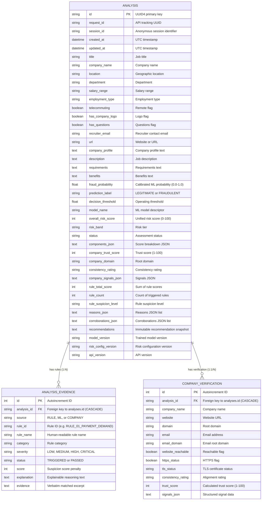

# AuthentiHire — Database Architecture & Analysis Persistence Report
**Phase 8: Database & Analysis Persistence**  
*AuthentiHire Engineering Architecture Documentation*

---

## 1. Executive Summary

Phase 8 introduces a decoupled, transaction-safe persistence architecture for AuthentiHire. By integrating **SQLAlchemy 2.x** and **Alembic** migrations, the platform now saves every job posting analysis as an immutable snapshot. This architecture enables historical review, paginated session tracking, explainable evidence retrieval, and individual record management while preserving complete decoupling from core ML inference algorithms and laying the architectural foundation for Phase 9 authentication.

---

## 2. Database Technology & Configuration

| Component | Technology | Version | Purpose |
| :--- | :--- | :--- | :--- |
| **ORM Framework** | SQLAlchemy | `2.0.43` | Declarative models, relationship cascading, parameterized SQL query generation |
| **Migration Tool** | Alembic | `1.20.0` | Controlled, version-tracked database schema migrations |
| **Production Target** | PostgreSQL (`postgresql+psycopg://`) | `>=14.0` | Multi-connection pooling, ACID transactions, relational indexing |
| **Development & Test** | SQLite (`sqlite:///./data/authentihire.db`) | `3.x` | Zero-configuration local dev and isolated in-memory test suites |
| **Configuration** | Environment Variables | — | Dynamically configured via `DATABASE_URL` |

---

## 3. Database Schema & Entity Relationships

The persistence schema consists of three normalized tables designed for high-integrity relational storage and fast snapshot retrieval.



---

## 4. Persistence Flow & Snapshot Immutability

```
User Posting Input
       │
       ▼
FastAPI POST /api/v1/analyze
       │
       ├─► Extract / Generate Anonymous Session ID (`X-Session-ID`)
       ├─► Execute ML Model + Rule Engine + Company Intelligence
       ├─► Synthesize Unified Risk Score & Actionable Recommendations
       │
       ▼
AnalysisRepository.save_analysis (Atomic Database Transaction)
       │
       ├─► Insert into `analyses` table (Job metadata, Risk metrics, Snapshot text)
       ├─► Insert 1:N rows into `analysis_evidence` table (Triggered rules & verbatim excerpts)
       ├─► Insert into `company_verifications` table (Domain & TLS signals)
       ├─► COMMIT transaction (or ROLLBACK on any failure)
       │
       ▼
Return JobAnalysisResponse (with persistent `analysis_id` & `session_id`)
```

### Snapshot Immutability Principle
A key architectural requirement is **report reproducibility**. When an existing analysis is requested via `GET /api/v1/analyses/{analysis_id}`, the system reconstructs the response directly from the stored database snapshot using `AnalysisRepository.to_analysis_response()`. **The ML models and heuristic rules are never re-evaluated on historical data.** This guarantees that future model retraining or rule updates will never alter historical audit records.

---

## 5. Session Ownership & Access Control (Pre-Auth)

While user authentication (JWT/OAuth) is reserved for Phase 9, Phase 8 establishes secure ownership boundaries:

1. **Session Identifiers**: Analyses are associated with an anonymous `session_id` passed via the `X-Session-ID` HTTP header (or query param).
2. **Access Isolation**:
   - `GET /api/v1/analyses/{analysis_id}` strictly checks `Analysis.session_id == requesting_session_id`.
   - Access attempts with mismatched or missing sessions return `404 Not Found` (preventing ID enumeration or metadata leakage).
3. **Owner-Only Deletion**:
   - `DELETE /api/v1/analyses/{analysis_id}` only deletes if the record belongs to the requesting session.
4. **No Fingerprinting**: IP addresses and browser fingerprints are **never** stored or used as identities.

---

## 6. Data Privacy & Minimization Review

| Field Category | Stored Attributes | Justification / Privacy Control |
| :--- | :--- | :--- |
| **Job Posting Text** | Title, location, department, description, requirements, benefits | Necessary for exact report reconstruction; internal text only |
| **Entity Identifiers** | Recruiter email, Company domain, Website URL | Minimal contact attributes needed to explain domain mismatches |
| **Scam Evidence** | Verbatim trigger excerpts (e.g. fee demands) | Stored in structured `analysis_evidence` rows for auditability |
| **Exclusions** | Full web pages, raw HTML scrapes, applicant PII | **Explicitly NOT stored**; external web pages are never archived |

---

## 7. Migration Strategy with Alembic

The database schema is managed through version-controlled Alembic migrations:

- **Configuration**: `alembic.ini` and `alembic/env.py` dynamically resolve `DATABASE_URL`.
- **Initial Migration**: `alembic/versions/001_initial_schema.py` defines all tables, indexes, constraints, and cascading foreign keys.
- **Applying Migrations**:
  ```bash
  alembic upgrade head
  ```
- **Creating Future Migrations**:
  ```bash
  alembic revision --autogenerate -m "add_phase9_user_table"
  ```

---

## 8. REST API Endpoints

| Method | Endpoint | Description | Auth / Scope |
| :--- | :--- | :--- | :--- |
| `POST` | `/api/v1/analyze` | Evaluates posting, persists record, returns `analysis_id` | `X-Session-ID` (optional, auto-generated if absent) |
| `GET` | `/api/v1/analyses/{id}` | Fetches stored snapshot without re-running inference | `X-Session-ID` (required, strictly matches owner) |
| `GET` | `/api/v1/analyses` | Lists paginated analysis history (`limit`, `offset`) | `X-Session-ID` (required) |
| `DELETE` | `/api/v1/analyses/{id}` | Permanently deletes analysis and cascaded evidence | `X-Session-ID` (required, strictly matches owner) |
| `GET` | `/api/v1/health` | Readiness and database connection check | Public |
| `GET` | `/api/v1/model-info` | Non-sensitive model descriptors and risk weights | Public |

---

## 9. Performance Benchmark Results

Measured locally over 20 iterations using `fastapi.testclient`:

| Endpoint / Operation | Mean Latency | Median Latency | Min Latency | Max Latency |
| :--- | :--- | :--- | :--- | :--- |
| **POST /api/v1/analyze** (ML + Rules + DB Transaction) | **11.21 ms** | 5.01 ms | 4.53 ms | 121.79 ms |
| **GET /api/v1/analyses/{id}** (DB Read + Snapshot) | **1.50 ms** | 1.34 ms | 1.24 ms | 3.89 ms |
| **GET /api/v1/analyses** (Paginated Session History) | **1.28 ms** | 1.17 ms | 1.11 ms | 3.29 ms |

---

## 10. Test Suite & Validation Summary

### Backend Unit & Integration Tests (85 Tests Passing)
- **`tests/test_database.py` (17 tests)**:
  1. `test_01_database_connection`: Verified SQLite & PostgreSQL connection execution.
  2. `test_02_table_creation_and_schema`: Verified all 3 tables created with correct columns and types.
  3. `test_03_create_analysis`: Verified `Analysis` record creation and field mapping.
  4. `test_04_retrieve_analysis`: Verified record retrieval by primary key.
  5. `test_05_delete_analysis`: Verified hard deletion and foreign key cascading.
  6. `test_06_evidence_persistence`: Verified multiple `AnalysisEvidence` entries.
  7. `test_07_company_verification_persistence`: Verified `CompanyVerification` entries.
  8. `test_08_risk_metadata_persistence`: Verified model version and configuration metadata.
  9. `test_09_session_ownership`: Verified session matching access.
  10. `test_10_cross_session_access_denial`: Verified security isolation against unauthorized sessions.
  11. `test_11_pagination`: Verified limit and offset pagination.
  12. `test_12_transaction_rollback`: Verified complete atomic rollback on database failure.
  13. `test_13_invalid_analysis_id`: Verified clean handling of non-existent IDs.
  14. `test_14_empty_history`: Verified empty history returns zero items.
  15. `test_15_multiple_analyses_ordering`: Verified newest-first sorting (`created_at DESC`).
  16. `test_16_historical_snapshot_consistency`: Verified exact snapshot reproduction without ML rerun.
  17. `test_17_updated_at_timestamp`: Verified timestamp initialization and updates.
- **`tests/test_api.py` (20 tests)**: API routing, persistence roundtrip, session isolation, 400/404/422 handling.
- **`tests/test_company_intelligence.py` (17 tests)**: Verified domain heuristics and consistency.
- **`tests/test_risk_assessment.py` (12 tests)**: Verified unified risk scoring.
- **`tests/test_risk_validation.py` (9 tests)**: Verified frozen model validation.
- **`tests/test_rule_engine.py` (10 tests)**: Verified scam heuristics.

### Frontend Tests (13 Tests Passing)
- Vitest unit tests: 13 passed cleanly.
- TypeScript build (`tsc -b && vite build`): Zero type errors.

---

## 11. Phase 9 Migration Path

When user authentication is implemented in Phase 9:
1. Add a `users` table (`id`, `email`, `hashed_password`, `created_at`).
2. Add nullable `user_id` foreign key column to `analyses` table via Alembic migration (`002_add_user_ownership.py`).
3. Migrate anonymous session analyses upon user registration/login:
   `UPDATE analyses SET user_id = :uid WHERE session_id = :sid AND user_id IS NULL;`
4. Update API dependencies from anonymous `session_id` to authenticated `current_user.id`.
